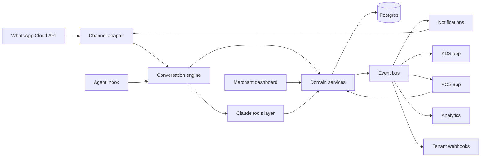

# ordr.ae WhatsApp Platform: Product and Architecture Plan

Status: draft v0.1, 2026-10-05. Decisions marked "assumed" are open for review (see section 14).

## 1. Vision

One platform that lets any local business run its customer interactions on WhatsApp. A merchant
connects a WhatsApp number, picks a vertical blueprint (restaurant, salon, clinic, ...), loads a
catalog and staff, and has a working bot the same day. The same order and booking core later
powers a POS and a Kitchen Display System (KDS), so a WhatsApp order and a counter order are the
same thing to the business.

### Target verticals

| Wave | Vertical | Core job to be done |
|------|----------|---------------------|
| 1 | Food and beverage (restaurant, cloud kitchen, cafe) | Menu browsing, cart, checkout, delivery or pickup, order status, dine-in via QR, table reservation |
| 2 | Salon, spa, barbershop | Service booking with staff choice, reminders, rescheduling |
| 3 | Clinics (GP, dental, physio, aesthetic) | Doctor appointment, patient intake, reminders, follow-ups, with health-data compliance |
| Later | Home services, gyms and classes, car wash, retail, laundry, hotels, pharmacies, event tickets | Variants of the same primitives |

### Non-goals for v1

- WhatsApp groups, voice and video calls.
- Native WhatsApp payments (not available in the UAE; payment links instead).
- A fully LLM-driven free-form agent with no guard rails.

## 2. The unifying model

Every vertical above is a combination of the same primitives. Designing around these, rather than
around "restaurants" or "salons", is what makes the platform flexible.

| Core concept | Food ordering | Salon | Clinic |
|--------------|---------------|-------|--------|
| Offering | Menu item with modifiers | Service with duration and price | Consultation type |
| Resource | Kitchen capacity, delivery zone, table | Stylist, chair | Doctor, room |
| Slot | Delivery window, pickup time, table time | Appointment slot | Appointment slot |
| Order | Food order | Booking | Appointment |
| Fulfillment type | delivery, pickup, dine_in | in_store, at_home | in_clinic, telehealth |
| Lifecycle | placed, accepted, preparing, ready, out_for_delivery, delivered | requested, confirmed, checked_in, in_progress, completed, no_show | as salon, plus intake_pending |
| Downstream systems | KDS, POS, rider | POS, staff calendar | Clinic software, POS |

Definition: an Order has line items (Offerings), an optional Resource assignment, an optional
Slot, a Fulfillment type, zero or more Payments, and a state machine whose states and transitions
come from the tenant's blueprint.

## 3. Architecture overview



Layers, from the outside in:

1. Channel layer. WhatsApp Cloud API adapter: webhook ingestion, message sending, template
   management, media. Behind a Channel interface so Instagram DM, Messenger, web chat or SMS can be
   added later without touching the engine.
2. Conversation engine. Per-customer session state, a declarative flow runner, builders for
   WhatsApp interactive messages, LLM assistance for free text, and handoff to a human agent.
3. Domain services. Tenant and onboarding, Catalog, Scheduling and availability, Orders and
   bookings, Payments, Customers (CRM), Notifications and reminders, Resources and staff, Locations.
4. Event bus. Every domain change emits an event via a transactional outbox. Consumers:
   notifications, KDS, POS, analytics, outbound webhooks.
5. Apps. Merchant dashboard, POS, KDS, agent inbox, super-admin console.
6. Platform. Multi-tenancy, auth and roles, billing, audit log, observability.

## 4. Key decisions

Each of these should become a short ADR file under docs/adr once confirmed.

- ADR-001 WhatsApp provider: use Meta's Cloud API directly (assumed). No per-message markup from a
  Business Solution Provider, Embedded Signup gives self-serve onboarding, and all features (Flows,
  catalog messages, templates) are available. Keep a provider interface so a BSP (360dialog,
  Gupshup, Twilio) can be plugged in for merchants who already have a number there.
- ADR-002 Conversation style: declarative flows as the backbone, LLM as an assistant, not LLM
  only. Money and medical contexts need predictable confirmations, Meta policy requires it, and it
  is testable. The LLM handles intent detection on free text, entity extraction ("2 chicken
  shawarma no onions, tomorrow 7pm"), FAQ answers from a tenant knowledge base, Arabic and English
  handling, and reply drafting for human agents. The LLM only acts through typed, tenant-scoped
  tools and never writes to the database directly.
- ADR-003 Blueprints are configuration, not forks. A blueprint is a versioned package: flows,
  offering schema extensions, order state machine, fulfillment types, message copy, dashboard
  modules, default settings. Tenants inherit a blueprint and override parts of it.
- ADR-004 Multi-tenancy: one Postgres database, tenant_id on every row, Row Level Security
  enforced at the connection level. Revisit database-per-tenant only for enterprise accounts.
- ADR-005 Integration is event-driven. Outbox table in Postgres, published to Redis Streams at
  first, upgradeable to NATS or Kafka. POS and KDS are event consumers plus their own command APIs.
- ADR-006 TypeScript monorepo (assumed). Shared domain types and flow schema across bot,
  dashboard, POS and KDS are worth more than any single-language advantage elsewhere.
- ADR-007 Hosting in a UAE region (AWS me-central-1 or Azure UAE North) for the Personal Data
  Protection Law and for health-data residency.
- ADR-008 Payments through a PSP abstraction producing payment links: Stripe UAE, Telr, Network
  International N-Genius, Ziina, plus Tabby or Tamara for buy now pay later, and cash on delivery.

## 5. Conversation engine

### Session

Keyed by tenant and WhatsApp id. Hot copy in Redis with TTL, snapshot in Postgres. Holds current
flow and step, context (cart, chosen resource, draft booking), language, and last inbound timestamp
(needed to know whether the 24 hour customer service window is open).

### Flow definition

A flow is a graph of typed nodes stored as JSON and validated by a schema:

- message: send text, media or a template.
- question: ask with reply buttons (max 3), a list (max 10 rows in sections), free text,
  location request, or media upload. Includes validation and retry copy.
- form: open a WhatsApp Flow (native in-chat form) for date and time pickers, intake forms,
  address capture.
- catalog: send single or multi product messages backed by the Meta Commerce catalog.
- action: call a domain service (search availability, add to cart, create order, create payment
  link).
- branch: route on context or on the result of an action.
- subflow, handoff, end.

### Inbound routing

1. Interactive reply payload (button or list id, Flow response, order message): deterministic,
   go to the step that is waiting for it.
2. Global commands (menu, cancel, agent, language): jump regardless of state.
3. Free text: LLM intent classification over the intents enabled for this tenant, with entity
   extraction. Start the matching flow with slots pre-filled, or answer from the knowledge base.
4. Nothing matched: show the main menu.

### Other engine concerns

- Human handoff: agent inbox, bot pauses for that customer, agent replies, bot resumes on command
  or timeout.
- Idempotency: Meta delivers webhooks at least once; dedupe on message id.
- 24 hour window: free-form replies only inside the window; otherwise send an approved template.
- Localization: all copy lives in tenant-editable message bundles. Arabic (right to left) and
  English first; Hindi, Urdu, Tagalog and Malayalam are realistic later additions for the UAE.
  Language detected from the first message and stored per customer.
- Testing: a WhatsApp simulator that replays webhook payloads so flows can be unit tested without
  a real number.

## 6. Domain model, first cut

Tenant, Location, Channel (a WABA phone number), User (staff login), Role, Customer, Offering
(type product or service, category, price, duration, modifiers and variants, availability rules,
tax class), Resource (type staff, room, table or asset; skills mapping to offerings; working hours,
breaks, time off), AvailabilityRule, Order (type order, booking or appointment; status;
fulfillment; scheduled_at; items; totals; payment status; source whatsapp, pos or web), OrderItem,
Payment, Conversation, Message, FlowDefinition, Blueprint, MessageTemplate, Event, Webhook,
AuditLog.

Example blueprint fragment:

```json
{
  "id": "salon",
  "version": 1,
  "offeringType": "service",
  "fulfillmentTypes": ["in_store", "at_home"],
  "orderStates": ["requested", "confirmed", "checked_in", "in_progress", "completed", "cancelled", "no_show"],
  "scheduling": { "mode": "resource", "slotStepMinutes": 15, "bufferMinutes": 10, "holdMinutes": 5 },
  "flows": ["main_menu", "book_service", "manage_booking", "faq"],
  "reminders": [{ "before": "PT24H", "template": "booking_reminder" }, { "before": "PT2H", "template": "booking_reminder" }],
  "dashboardModules": ["calendar", "resources", "customers", "broadcasts"]
}
```

## 7. Scheduling engine

- Availability is computed as resource working hours, minus time off, minus existing bookings,
  intersected with location hours, offering duration plus buffer, lead time, and maximum advance.
- Two modes: resource-based (a specific stylist or doctor) and capacity-based (any of N chairs,
  tables or rooms).
- Slot holds: a slot is held for a few minutes during checkout. A unique constraint on
  (resource, start time) plus a transaction prevents double booking under concurrency.
- Reminders are scheduled jobs that send template messages with confirm, reschedule and cancel
  buttons. No-show tracking and a waitlist feed back into availability.
- Food uses the same engine differently: prep-time estimates, kitchen throttling (maximum orders
  per 15 minutes), scheduled orders, and delivery zones as polygons with fees and minimums.

## 8. POS and KDS as extensions

Both consume the same Order service and event stream. Nothing in the kitchen or at the counter
needs to know whether an order came from WhatsApp.

### KDS

Web app on a screen or tablet, subscribed over WebSocket to order events for a location and
station. Ticket states: new, in progress, ready, bumped. Station routing by item category (grill,
cold, drinks). SLA timers, sound alerts, recall. Status changes flow back to the customer on
WhatsApp automatically. The salon and clinic equivalent is a day view and check-in board.

### POS

Progressive web app for counter or tablet: product grid, modifiers, cart, discounts, split
payments, cash drawer, receipts printed or sent on WhatsApp, shift and Z reports, UAE VAT (5%)
compliant invoices. Offline-first with a local queue (IndexedDB) that syncs when back online.
Later: receipt printers over ESC/POS, card terminal integrations, bump bars.

## 9. Merchant dashboard

- Onboarding wizard: Embedded Signup, pick a blueprint, import catalog from CSV, Excel or an
  existing Meta catalog, set hours and staff, send a test message.
- Live inbox with bot and agent conversations.
- Orders and bookings: board view for food, calendar for appointments.
- Catalog, resources, customers, broadcasts (template based, opt-in list only), analytics.
- Settings: payments, languages, copy, templates. A visual flow editor comes later; JSON editing
  with validation first.

## 10. Compliance and policy

WhatsApp:

- Business and Commerce policies. Pharmacies and some health products are restricted in catalogs.
- Opt-in required for marketing. Templates need approval and have categories (utility, marketing,
  authentication) with per-message pricing. Utility messages inside the open window are free.
- Quality rating and messaging tier limits: broadcast tooling must rate-limit and honor opt-outs
  or the whole number gets throttled.

UAE:

- Personal Data Protection Law (Federal Decree-Law 45 of 2021): consent capture, retention
  policies, deletion requests.
- Health data: Federal Law No. 2 of 2019 on ICT in Health Fields requires health data to stay in
  the UAE unless exempted. The clinic blueprint must keep data in-region, collect intake through
  Flows rather than chat text, avoid putting diagnoses or results in messages, and log access.
- VAT invoicing requirements for POS receipts.

## 11. Tech stack proposal (assumed)

| Area | Choice |
|------|--------|
| Backend | Node 22, TypeScript, NestJS, Prisma, PostgreSQL 16, Redis 7 |
| Jobs and events | BullMQ for reminders and retries, Redis Streams for events, outbox pattern |
| Frontend | Next.js, Tailwind, shadcn/ui; POS and KDS as PWAs |
| Realtime | WebSocket (Socket.IO) for KDS, POS and inbox |
| LLM | Claude through the Anthropic SDK: Sonnet 5.5 for conversation and extraction, Haiku 4.5 for cheap intent classification |
| Infra | AWS me-central-1, ECS Fargate, RDS, ElastiCache, S3 and CloudFront, Terraform, GitHub Actions |
| Observability | OpenTelemetry traces, Grafana stack or Datadog, Sentry |
| Testing | Vitest, Playwright, webhook replay simulator |

Monorepo layout:

```
apps/
  api/            NestJS: channel adapter, engine, domain services, event publisher
  worker/         BullMQ consumers: reminders, outbox relay, catalog sync
  dashboard/      Merchant web app
  pos/            POS PWA
  kds/            KDS PWA
  admin/          Super-admin console
packages/
  domain/         Shared types, state machines, validation schemas
  flow-schema/    Flow and blueprint JSON schemas plus runner
  whatsapp/       Cloud API client, message builders, webhook types
  blueprints/     restaurant/, salon/, clinic/ packages
  ui/             Shared components
  sdk/            Public API client for third parties
docs/
  adr/
infra/            Terraform
```

## 12. Roadmap

Durations assume two to three engineers. Each phase has an exit criterion.

| Phase | Scope | Exit criterion |
|-------|-------|----------------|
| 0. Foundations (3 weeks) | Monorepo, tenant model, Embedded Signup, webhook ingestion with dedupe, outbound with templates, session store, flow runner with the main node types, simulator | A hello-world flow runs end to end on a real number for two tenants |
| 1. Food ordering MVP (5 weeks) | Restaurant blueprint, catalog with modifiers, cart, checkout, payment links, order status updates, delivery zones, merchant orders board, agent inbox basics | Two or three pilot restaurants taking live orders |
| 2. Scheduling and salon (4 weeks) | Availability engine, resources, slot holds, booking flow using WhatsApp Flows date picker, reminders, calendar view | One pilot salon running bookings with reminders |
| 3. Clinic (4 weeks) | Clinic blueprint, intake forms, consent capture, in-region data controls, audit log, capacity mode | One pilot clinic, compliance checklist signed off |
| 4. KDS then POS (8 weeks) | KDS with stations and bump flow, then POS with offline sync, receipts, VAT invoices | A pilot restaurant runs kitchen and counter entirely on the platform |
| 5. Growth | Broadcasts and campaigns, loyalty, analytics, visual flow editor, public API and webhooks, more blueprints, Instagram channel, delivery partner integrations | Driven by merchant demand |

## 13. Risks and mitigations

- Meta account quality drops or bans from spammy broadcasts: enforce opt-in, rate limit, monitor
  quality rating per number, warn merchants.
- Template approval delays: ship a library of pre-approved generic templates per blueprint.
- LLM states a wrong price or slot: the LLM only reads through tools, and the final confirmation
  step is always deterministic with values from the database.
- Double bookings: database constraints, not application checks alone.
- Webhook duplicates and ordering: idempotency keys, per-customer processing queue.
- Catalog drift between our database and Meta Commerce Manager: our catalog is the source of
  truth, sync job pushes to Meta and reports diffs.
- Merchants with numbers at an existing BSP: number migration runbook and the provider interface
  from ADR-001.

## 14. Open questions

1. Which vertical ships first? Food ordering is assumed given the ordr brand.
2. Any existing BSP relationship, or go direct to Meta's Cloud API?
3. Team size and stack preference. TypeScript is assumed.
4. Merchant pricing model: subscription plus pass-through of WhatsApp conversation costs? This
   shapes the billing module.
5. Which payment providers do you already have accounts with?
6. Languages beyond Arabic and English for launch.
7. Cloud preference. AWS and Azure have UAE regions; GCP does not.
8. Hosted multi-tenant SaaS only, or also single-tenant deployments for larger clients?
9. Delivery: merchants' own riders, or integrations with Careem, Talabat or Deliveroo logistics?
